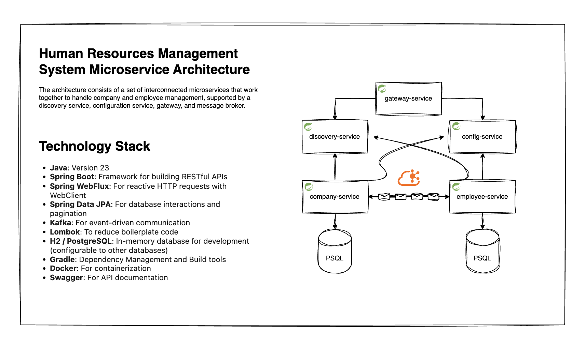

# Java Backend Training Task



- [Training Task](docs/training-task.docx)

## User API Documentation for Employee and Company Services 

This document provides detailed information on how to interact with the Employee and Company Services APIs. The APIs allow users to manage employee and company data, including creating, retrieving, updating, and deleting records. The services are built with Spring Boot and integrate with Kafka for event-driven updates and WebClient for cross-service communication.

## Base URL
All API requests are made to the base URL:  
**`http://localhost:8080/api/`**

## Swagger Documentation
Swagger UI is available for both services at their respective ports:
- **Employee Service**: `http://localhost:8081/swagger-ui.html`
- **Company Service**: `http://localhost:8082/swagger-ui.html`

## Table of Contents
1. [Employee Service Endpoints](#employee-service-endpoints)
   - [Create Employee](#create-employee)
   - [Get Employee by ID](#get-employee-by-id)
   - [Update Employee](#update-employee)
   - [Delete Employee](#delete-employee)
   - [Get All Employees](#get-all-employees)
2. [Company Service Endpoints](#company-service-endpoints)
   - [Create Company](#create-company)
   - [Get Company by ID](#get-company-by-id)
   - [Update Company](#update-company)
   - [Delete Company](#delete-company)
   - [Get All Companies](#get-all-companies)
3. [Technology Stack](#technology-stack)
4. [Installation Guide for HRM Services with Docker Compose](#installation-guide-for-hrm-services-with-docker-compose)

---

## Employee Service Endpoints

The Employee Service manages employee data and is accessible at `http://localhost:8080/api/employees`.

### Create Employee
- **Endpoint**: `POST /api/employees`
- **Description**: Creates a new employee with a generated UUID and optionally assigns them to a company.
- **Request Body**: JSON (`EmployeeRequest`)
  ```json
  {
    "firstName": "string",
    "lastName": "string",
    "phone": "string",
    "companyId": "UUID" (optional)
  }
  ```
- **Response**: HTTP 200 (OK) with the created Employee DTO.
- **Mock Request**:
  ```json
  POST http://localhost:8080/api/employees
  Content-Type: application/json

  {
    "firstName": "John",
    "lastName": "Doe",
    "phone": "123-456-7890",
    "companyId": "550e8400-e29b-41d4-a716-446655440001"
  }
  ```
- **Mock Response**:
  ```json
  {
    "id": "550e8400-e29b-41d4-a716-446655440000",
    "firstName": "John",
    "lastName": "Doe",
    "phone": "123-456-7890",
    "companyId": "550e8400-e29b-41d4-a716-446655440001"
  }
  ```

### Get Employee by ID
- **Endpoint**: `GET /api/employees/{id}?extraInfo={boolean}`
- **Description**: Retrieves an employee by their UUID. If `extraInfo=true`, includes company details.
- **Path Parameters**:
  - `id`: UUID (required)
- **Query Parameters**:
  - `extraInfo`: Boolean (default: `false`)
- **Response**:
  - If `extraInfo=false`: `EmployeeResponse`
  - If `extraInfo=true`: `EmployeeFullResponse`
- **Mock Request**:
  ```json
  GET http://localhost:8080/api/employees/550e8400-e29b-41d4-a716-446655440000?extraInfo=true
  ```
- **Mock Response** (with `extraInfo=true`):
  ```json
  {
    "id": "550e8400-e29b-41d4-a716-446655440000",
    "firstName": "John",
    "lastName": "Doe",
    "phone": "123-456-7890",
    "company": {
      "id": "550e8400-e29b-41d4-a716-446655440001",
      "name": "Acme Corp",
      "budget": 1000000,
      "employeeIds": ["550e8400-e29b-41d4-a716-446655440000"]
    }
  }
  ```
- **Mock Response** (with `extraInfo=false`):
  ```json
  {
    "id": "550e8400-e29b-41d4-a716-446655440000",
    "firstName": "John",
    "lastName": "Doe",
    "phone": "123-456-7890",
    "companyId": "550e8400-e29b-41d4-a716-446655440001"
  }
  ```

### Update Employee
- **Endpoint**: `PUT /api/employees/{id}`
- **Description**: Updates an employee’s details and optionally reassigns them to a different company.
- **Path Parameters**:
  - `id`: UUID (required)
- **Request Body**: JSON (`EmployeeRequest`)
  ```json
  {
    "firstName": "string",
    "lastName": "string",
    "phone": "string",
    "companyId": "UUID" (optional)
  }
  ```
- **Response**: HTTP 200 (OK) with the updated Employee DTO.
- **Mock Request**:
  ```json
  PUT http://localhost:8080/api/employees/550e8400-e29b-41d4-a716-446655440000
  Content-Type: application/json

  {
    "firstName": "John",
    "lastName": "Smith",
    "phone": "987-654-3210",
    "companyId": "550e8400-e29b-41d4-a716-446655440002"
  }
  ```
- **Mock Response**:
  ```json
  {
    "id": "550e8400-e29b-41d4-a716-446655440000",
    "firstName": "John",
    "lastName": "Smith",
    "phone": "987-654-3210",
    "companyId": "550e8400-e29b-41d4-a716-446655440002"
  }
  ```

### Delete Employee
- **Endpoint**: `DELETE /api/employees/{id}`
- **Description**: Deletes an employee by their UUID and removes their association with a company, if applicable.
- **Path Parameters**:
  - `id`: UUID (required)
- **Response**: HTTP 200 (OK) with the deleted Employee DTO.
- **Mock Request**:
  ```json
  DELETE http://localhost:8080/api/employees/550e8400-e29b-41d4-a716-446655440000
  ```
- **Mock Response**:
  ```json
  {
    "id": "550e8400-e29b-41d4-a716-446655440000",
    "firstName": "John",
    "lastName": "Doe",
    "phone": "123-456-7890",
    "companyId": null
  }
  ```

### Get All Employees
- **Endpoint**: `GET /api/employees/all?page={page}&size={size}&sort={sort}&extraInfo={boolean}`
- **Description**: Retrieves a paginated list of employees. If `extraInfo=true`, includes company details.
- **Query Parameters**:
  - `page`: Integer (default: 0)
  - `size`: Integer (default: 20)
  - `sort`: String (e.g., `id,asc`)
  - `extraInfo`: Boolean (default: `false`)
- **Response**:
  - If `extraInfo=false`: `Page<EmployeeResponse>`
  - If `extraInfo=true`: `Page<EmployeeFullResponse>`
- **Mock Request**:
  ```json
  GET http://localhost:8080/api/employees/all?page=0&size=10&extraInfo=true
  ```
- **Mock Response**:
  ```json
  {
    "content": [
      {
        "id": "550e8400-e29b-41d4-a716-446655440000",
        "firstName": "John",
        "lastName": "Doe",
        "phone": "123-456-7890",
        "company": {
          "id": "550e8400-e29b-41d4-a716-446655440001",
          "name": "Acme Corp",
          "budget": 1000000,
          "employeeIds": ["550e8400-e29b-41d4-a716-446655440000"]
        }
      }
    ],
    "pageable": {
      "sort": { "sorted": true, "unsorted": false, "empty": false },
      "offset": 0,
      "pageNumber": 0,
      "pageSize": 10,
      "paged": true,
      "unpaged": false
    },
    "totalPages": 1,
    "totalElements": 1,
    "last": true
  }
  ```

---

## Company Service Endpoints

The Company Service manages company data and is accessible at `http://localhost:8080/api/companies`.

### Create Company
- **Endpoint**: `POST /api/companies`
- **Description**: Creates a new company with a generated UUID and optionally associates employees with it.
- **Request Body**: JSON (`CompanyRequest`)
  ```json
  {
    "name": "string",
    "budget": long,
    "employeeIds": ["UUID"] (optional)
  }
  ```
- **Response**: HTTP 200 (OK) with the created Company DTO.
- **Mock Request**:
  ```json
  POST http://localhost:8080/api/companies
  Content-Type: application/json

  {
    "name": "Acme Corp",
    "budget": 1000000,
    "employeeIds": ["550e8400-e29b-41d4-a716-446655440000"]
  }
  ```
- **Mock Response**:
  ```json
  {
    "id": "550e8400-e29b-41d4-a716-446655440001",
    "name": "Acme Corp",
    "budget": 1000000,
    "employeeIds": ["550e8400-e29b-41d4-a716-446655440000"]
  }
  ```

### Get Company by ID
- **Endpoint**: `GET /api/companies/{id}?extraInfo={boolean}`
- **Description**: Retrieves a company by its UUID. If `extraInfo=true`, includes employee details.
- **Path Parameters**:
  - `id`: UUID (required)
- **Query Parameters**:
  - `extraInfo`: Boolean (default: `false`)
- **Response**:
  - If `extraInfo=false`: `CompanyResponse`
  - If `extraInfo=true`: `CompanyFullResponse`
- **Mock Request**:
  ```json
  GET http://localhost:8080/api/companies/550e8400-e29b-41d4-a716-446655440001?extraInfo=true
  ```
- **Mock Response** (with `extraInfo=true`):
  ```json
  {
    "id": "550e8400-e29b-41d4-a716-446655440001",
    "name": "Acme Corp",
    "budget": 1000000,
    "employees": [
      {
        "id": "550e8400-e29b-41d4-a716-446655440000",
        "firstName": "John",
        "lastName": "Doe",
        "phone": "123-456-7890",
        "companyId": "550e8400-e29b-41d4-a716-446655440001"
      }
    ]
  }
  ```
- **Mock Response** (with `extraInfo=false`):
  ```json
  {
    "id": "550e8400-e29b-41d4-a716-446655440001",
    "name": "Acme Corp",
    "budget": 1000000,
    "employeeIds": ["550e8400-e29b-41d4-a716-446655440000"]
  }
  ```

### Update Company
- **Endpoint**: `PUT /api/companies/{id}`
- **Description**: Updates a company’s details and optionally reassigns employees.
- **Path Parameters**:
  - `id`: UUID (required)
- **Request Body**: JSON (`CompanyRequest`)
  ```json
  {
    "name": "string",
    "budget": long,
    "employeeIds": ["UUID"] (optional)
  }
  ```
- **Response**: HTTP 200 (OK) with the updated Company DTO.
- **Mock Request**:
  ```json
  PUT http://localhost:8080/api/companies/550e8400-e29b-41d4-a716-446655440001
  Content-Type: application/json

  {
    "name": "Acme Corp Updated",
    "budget": 2000000,
    "employeeIds": ["550e8400-e29b-41d4-a716-446655440002"]
  }
  ```
- **Mock Response**:
  ```json
  {
    "id": "550e8400-e29b-41d4-a716-446655440001",
    "name": "Acme Corp Updated",
    "budget": 2000000,
    "employeeIds": ["550e8400-e29b-41d4-a716-446655440002"]
  }
  ```

### Delete Company
- **Endpoint**: `DELETE /api/companies/{id}`
- **Description**: Deletes a company by its UUID.
- **Path Parameters**:
  - `id`: UUID (required)
- **Response**: HTTP 200 (OK) with the deleted Company DTO.
- **Mock Request**:
  ```json
  DELETE http://localhost:8080/api/companies/550e8400-e29b-41d4-a716-446655440001
  ```
- **Mock Response**:
  ```json
  {
    "id": "550e8400-e29b-41d4-a716-446655440001",
    "name": "Acme Corp",
    "budget": 1000000,
    "employeeIds": []
  }
  ```
...

## Technology Stack
- **Java**: Version 23
- **Spring Boot**: Framework for building RESTful APIs
- **Spring WebFlux**: For reactive HTTP requests with WebClient
- **Spring Data JPA**: For database interactions and pagination
- **Kafka**: For event-driven communication
- **Lombok**: To reduce boilerplate code
- **H2 / PostgreSQL**: In-memory database for development (configurable to other databases)
- **Gradle**: Dependency Management and Build tools 
- **Docker**: For containerization
- **Swagger**: For API documentation

---

## Installation Guide for HRM Services with Docker Compose

This guide walks you through the process of setting up the Human Resource Management (HRM) system, including the `gateway-service`, `company-service`, `employee-service`, `config-service`, `discovery-service`, Kafka, PostgreSQL databases, and related tools, using Docker Compose.

#### Prerequisites
- **Docker**: Ensure Docker is installed (version 20.10 or higher recommended). [Download Docker](https://docs.docker.com/get-docker/).
- **Docker Compose**: Ensure Docker Compose is installed (version 1.29 or higher recommended). It is included with Docker Desktop or can be installed separately [here](https://docs.docker.com/compose/install/).
- **Git** (optional): To clone the repository if the code is hosted remotely.
- **Environment Variables**: Prepare a `.env` file with the required environment variables (details below).
- **Project Directory**: Ensure the project structure matches the `compose.yaml` file, with subdirectories (`gateway-service`, `company-service`, `employee-service`, `config-service`, `discovery-service`) containing their respective `Dockerfile`s and application code.

#### Step-by-Step Installation

1. **Clone or Set Up the Project Repository**
   - If the code is in a Git repository, clone it:
     ```bash
     git clone https://github.com/simadimonyan/hrm-system-technical-task.git
     ```
   - Alternatively, create a directory structure manually and copy the `compose.yaml` file and service code into it.

2. **Create an Environment File (`.env`)**
   - Create a `.env` file in the root directory to store environment variables. Add the following variables with your desired values:
     ```
     COMPANY_POSTGRES_DB=company
     COMPANY_POSTGRES_USER=postgres
     COMPANY_POSTGRES_PASSWORD=company_admin123

     EMPLOYEE_POSTGRES_DB=employee
     EMPLOYEE_POSTGRES_USER=postgres
     EMPLOYEE_POSTGRES_PASSWORD=employee_admin123

     PGADMIN_DEFAULT_EMAIL=admin@admin.com
     PGADMIN_DEFAULT_PASSWORD=root
     ```
   - Adjust the database credentials and pgAdmin settings as needed.

3. **Prepare Service Configuration files**
    - Place the configuration files (`gateway-service.properties`, `employee-service.properties`, `company-service.properties`, `discovery-service.properties`) in the appropriate service directories or a centralized configuration directory.
    - For version control of configuration files, initialize a Git repository and commit the files in the `config-service/src/main/config-files` directory:
        ```bash
        cd config-service/src/main/config-files
        git init
        git add .
        git commit -m "Initial commit of configuration files"
        ```

4. **Run Docker Compose**
   - Navigate to the directory containing `compose.yaml`:
     ```bash
     cd hrm-system-technical-task
     ```
   - Start the services using Docker Compose:
     ```bash
     docker-compose up --build
     ```
   - The `--build` flag ensures the images are rebuilt if there are changes in the `Dockerfile`s or code. Omit it for subsequent runs if no changes are made.

6. **Verify Services**
   - Check that all containers are running:
     ```bash
     docker ps
     ```
   - Access the services at the following URLs:
     - **Gateway Service**: `http://localhost:8080`
     - **Company Service**: `http://localhost:8082`
     - **Employee Service**: `http://localhost:8081`
     - **Config Service**: `http://localhost:8083`
     - **Discovery Service**: `http://localhost:8084`
     - **Kafka UI**: `http://localhost:8000`
     - **pgAdmin**: `http://localhost:5050` (log in with the email and password from the `.env` file)

7. **Stop the Services**
   - To stop the services, press `Ctrl+C` in the terminal or run:
     ```bash
     docker-compose down
     ```
   - To remove all containers, networks, and volumes (use with caution):
     ```bash
     docker-compose down -v
     ```

#### Additional Notes
- **Ports**: Ensure ports `8080`, `8081`, `8082`, `8083`, `8084`, `8000`, `5432`, `5433`, `9092`, `9093`, and `5050` are not in use on your host machine.
- **Database Initialization**: The PostgreSQL containers will initialize with the databases and users specified in the `.env` file. Ensure the schema and data are set up in your application code if required.
- **Kafka**: The Kafka broker is configured with a single-node setup. For production, consider adding more nodes and configuring replication.
- **Troubleshooting**: If a service fails to start, check the logs:
  ```bash
  docker logs <container-name>
  ```

#### Example Workflow
- After starting the services, use the Gateway Service (`http://localhost:8080`) to route requests to the `company-service` or `employee-service`.
- Use pgAdmin (`http://localhost:5050`) to manage the `company-db` (port 5433) and `employee-db` (port 5432).
- Monitor Kafka topics and messages via the Kafka UI (`http://localhost:8000`).

---

### Usage Instructions

Once the services are running, you can interact with the HRM system as follows:

1. **Access the API**
   - Use the Gateway Service (`http://localhost:8080`) as the entry point for all API requests. The gateway routes requests to the appropriate `company-service` or `employee-service`.
   - Example API endpoints:
     - Create Employee: `POST http://localhost:8080/api/employees`
     - Get Company: `GET http://localhost:8080/api/companies/{id}`
   - Refer to the [User API Documentation](#) (if available) for detailed endpoint descriptions and mock requests.

2. **Database Management**
   - Log in to pgAdmin at `http://localhost:5050` using the email and password from the `.env` file.
   - Add servers for `company-db` (port 5433) and `employee-db` (port 5432) with the respective credentials from the `.env` file to manage database schemas and data.

3. **Kafka Monitoring**
   - Access the Kafka UI at `http://localhost:8000` to view topics, consumer groups, and messages.
   - Use the "local" cluster configuration to monitor Kafka events exchanged between `company-service` and `employee-service`.

4. **Service Discovery and Configuration**
   - The `discovery-service` (`http://localhost:8084`) can be checked for registered services using its default Eureka dashboard.
   - The `config-service` (`http://localhost:8083`) provides configuration data; consult the service documentation for accessing specific configurations.

This documentation was last updated on **Tuesday, August 19, 2025, at 08:43 PM +04**.

For further assistance or to report issues, contact work@dsimonyan.ru

